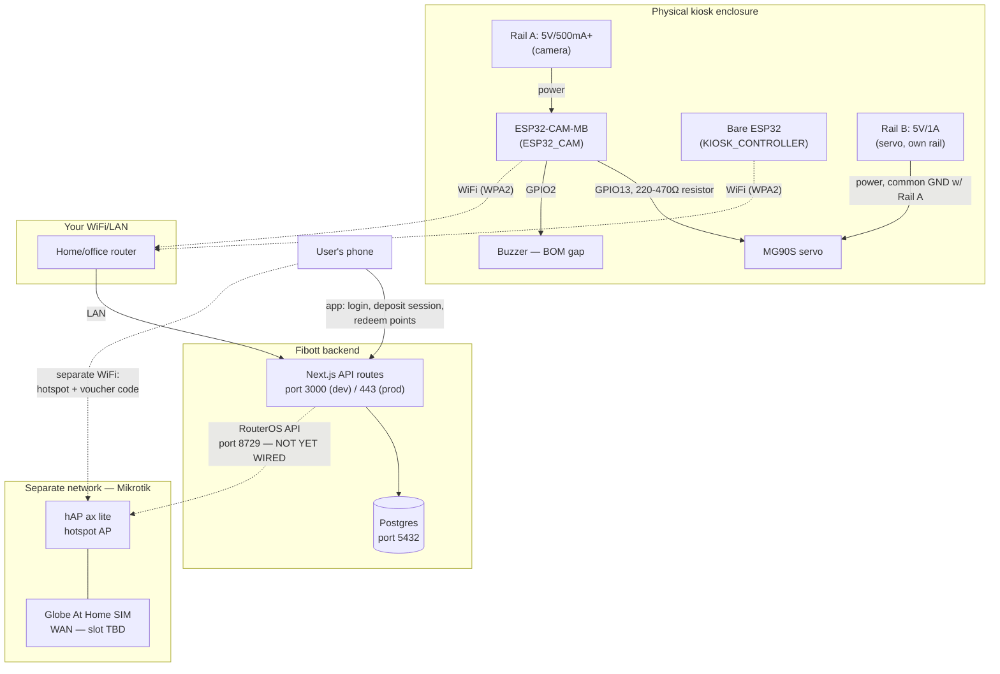

# Fibott — Full Connection Guide

Every physical and network connection between the parts you have, in one
place, organized by connection *type* rather than by device. This doc
doesn't repeat the *why* — that's in [`SYSTEM.md`](SYSTEM.md) (design
rationale) and [`../hardware/README.md`](../hardware/README.md) (pin-level
detail, BOM). This doc is the *what plugs into what, on which port*.

Related: [`ml.md`](ml.md) (classifier).

---

## 0. Parts inventory (confirming what you have)

| Part | Qty | Role in this guide |
|---|---|---|
| ESP32-CAM-MB (AI-Thinker + USB base board, OV2640) | 1 | `ESP32_CAM` — §2, §3, §4 |
| Bare ESP32 dev board | 2 (1 spare) | `KIOSK_CONTROLLER` — §3, §4 |
| MG90S servo (metal gear, micro) | 1 | §2 |
| Buzzer — **not yet in BOM** | 0 → 1 needed | §2 |
| Mikrotik hAP ax lite (L41G-2axD) | 1 | §5, §6 |
| Globe At Home SIM | 1 | §5 (WAN path unconfirmed) |
| Ethernet cables | on hand | §5 |
| Jumper wires, M-F, ≤40cm | on hand | §2 |
| 5V/1A PSU (servo) + 5V/500mA+ PSU (camera) | 0 → 2 needed | §1 |
| 220–470Ω resistor | 0 → 1 needed | §2 |

Two things still missing from the BOM (buzzer, power supplies) are called
out again in context below so they don't get lost.

---

## 1. Power connections

Three independent power rails. **Do not share a regulator between the
ESP32-CAM and the servo** — the camera's WiFi TX current spikes are enough
by themselves to brown out a shared supply and reset the camera mid-capture.

| Rail | Feeds | Spec | Shares ground with |
|---|---|---|---|
| Rail A | ESP32-CAM-MB | 5V, 500mA+ (its own micro-USB port doubles as this, or a dedicated 5V supply) | Rail B (common GND mandatory) |
| Rail B | MG90S servo | 5V, ~1A dedicated supply | Rail A |
| Rail C | Bare ESP32 (`KIOSK_CONTROLLER`) | 5V via its own micro-USB | independent — no shared GND needed with A/B unless you want one bus bar for convenience |
| Rail D | Mikrotik hAP ax lite | Its own PoE or barrel-jack PSU (comes with the unit) | independent |

**Common ground rule:** ESP32-CAM-MB GND, servo PSU GND, and servo GND
wire must all tie together (Rail A + Rail B), or the servo's PWM signal
has no valid reference and it jitters or ignores commands entirely.

---

## 2. Physical GPIO wiring (inside the kiosk enclosure)

All on the **ESP32-CAM-MB** board — the camera board drives the gate and
buzzer directly, since the accept/reject decision arrives there (see
`SYSTEM.md` §3.3 for why the two ESP32s split this way).

| Signal | ESP32-CAM-MB GPIO | Wire | Notes |
|---|---|---|---|
| Servo PWM | **GPIO13** | orange/signal wire, via 220–470Ω series resistor | Safe at boot, not shared with camera |
| Servo power | — | red wire → Rail B (+), brown/black wire → common GND | Not from the ESP32's own 3.3V/5V pin |
| Buzzer signal | **GPIO2** | direct | Free once SD card is left unpopulated (it is) |
| Buzzer power | — | → Rail A or its own 5V tap, GND → common | Active buzzer module: signal pin is enough to drive it |
| (Optional) presence sensor | GPIO14 or GPIO15 | digital in | Only if you add the IR break-beam from `SYSTEM.md` §3.4 |

Reserved / do-not-touch GPIOs (camera data lines): 5, 18, 19, 21, 36, 39,
34, 35, 0, 22, 25, 23, 26, 27, 32. Full pinout table with rationale:
[`../hardware/README.md`](../hardware/README.md).

All runs are short (camera board sits at the intake chute) — well within
your 40cm jumper wire stock.

---

## 3. USB / serial connections (flashing, one-time + debugging)

| Board | Cable | Chip | Notes |
|---|---|---|---|
| ESP32-CAM-MB | plain micro-USB, straight to your dev machine | onboard CH340C + auto-reset | **No separate FTDI/USB-TTL adapter needed** — the MB base board has it built in. This is different from a bare AI-Thinker ESP32-CAM module. |
| Bare ESP32 (×2) | micro-USB or USB-C (check your specific board) | onboard USB-serial (varies by board) | Standard Arduino/PlatformIO flashing, no auto-reset quirks typical of the CAM module |

Both are dev-time only. Once flashed and provisioned (§7), neither board
needs a USB connection to run — they operate over WiFi.

---

## 4. WiFi connections — ESP32 boards to your network

**Important distinction:** the ESP32-CAM and the bare ESP32
(`KIOSK_CONTROLLER`) join your **regular WiFi network** (home/office
router, or whatever LAN the backend is reachable from) — they do **not**
connect to the Mikrotik hotspot. The Mikrotik hotspot (§5) is a completely
separate WiFi network, for end users redeeming vouchers, and neither ESP32
board ever associates with it.

```
ESP32-CAM-MB  ---WiFi (WPA2, your LAN)--->  same network the backend is on
Bare ESP32    ---WiFi (WPA2, your LAN)--->  same network the backend is on
```

Both boards' firmware need your WiFi SSID/password hardcoded (or
provisioned via WiFiManager/similar) — this is unrelated to the Mikrotik
router entirely.

---

## 5. Mikrotik hAP ax lite — physical ports

| Port | Connects to | Direction |
|---|---|---|
| WAN (Ethernet, usually port 1 on hAP-series) | Your internet uplink | Confirm this against the actual unit: **open question** — does the hAP ax lite (L41G-2axD) take the Globe At Home SIM directly (it may have an internal LTE modem, hence "L4" in the model name), or does the SIM go into a *separate* LTE modem/router that then feeds this WAN port over Ethernet? Check the unit's physical slots before wiring — `SYSTEM.md` §7 flags this as unresolved. |
| LAN (Ethernet, remaining ports) | Wherever your backend server/dev machine lives, if it's on the same LAN | Only needed if the backend isn't reachable another way (e.g. if backend is deployed to the cloud, this port may be unused) |
| 2.4/5GHz hotspot WiFi (no physical port — radio) | End users' phones | The captive-portal network users join to enter their voucher code |

**The Mikrotik box is never wired to the ESP32 boards at all** — no
Ethernet, no WiFi association, nothing. It only needs a network path *to
the backend* (§6), and its own WAN uplink for internet.

---

## 6. Network / API ports — the software side

This is the "port connection" in the software sense: which TCP port each
service actually listens on or calls out to.

| Connection | Port | Protocol | Status |
|---|---|---|---|
| ESP32-CAM → backend `/api/device/deposit-image` | **3000** (local dev, `next dev`) or **443** (if/when deployed, e.g. Vercel) | HTTP (dev) / HTTPS (prod) | ✅ Built — multipart image upload, `x-device-api-key` header |
| ESP32-CAM → backend `/api/device/scan` | same as above | HTTP/HTTPS | ✅ Built — pre-classified test path (no image upload) |
| Bare ESP32 → backend `/api/device/sessions/activate` | same as above | HTTP/HTTPS | ✅ Built |
| Backend → Postgres | **5432** | Postgres wire protocol | ✅ Built (`DATABASE_URL` in `.env`, local install) |
| Backend → Mikrotik RouterOS API | **8728** (plain API) or **8729** (API-SSL) — pick 8729 | RouterOS API | ⏳ Not implemented yet — `mikrotik-client.ts` is stubbed; `MIKROTIK_HOST`/`USER`/`PASSWORD` env vars are read but unset |
| Backend → Resend (email) | 443 (HTTPS, outbound only) | HTTPS | ✅ Built, falls back to console-log if `RESEND_API_KEY` unset |
| User's phone → Mikrotik hotspot | — (WiFi association, not a "port" in the TCP sense) | 802.11 + captive portal | Depends on router's WAN resolution (§5) |

**Dev vs. production matters for firmware.** If the backend is running
locally on your dev machine (`npm run dev`, port 3000), the ESP32 boards
must be on the *same LAN* to reach `http://<your-machine-LAN-IP>:3000`.
If/when you deploy the backend (Vercel or otherwise), the firmware target
becomes a public HTTPS URL on port 443 instead — no LAN requirement, but
the ESP32's HTTP client needs a valid root CA (or `setInsecure()` for
early testing only, never for a fielded device).

---

## 7. Device provisioning (software ↔ physical device pairing)

Each physical board needs a matching `Device` row before it can call the
API. Already seeded for one kiosk (`prisma/seed.ts`):

| Firmware config | Value source |
|---|---|
| WiFi SSID/password | Your LAN, hardcoded or provisioned in firmware |
| Backend base URL | `http://<LAN-IP>:3000` (dev) or your deployed HTTPS URL (prod) |
| `x-device-api-key` header value | Generated once via `generateDeviceApiKey()` in `src/lib/device-auth.ts` — plaintext shown once, only the hash is stored server-side |
| Device role | Matches the `Device.type` row: `ESP32_CAM` or `KIOSK_CONTROLLER` |

To provision a *new* physical unit beyond the seeded one: insert a
`Device` row, generate a key, flash the plaintext key into that board's
firmware config. Full steps: [`../hardware/README.md`](../hardware/README.md)
§"Provisioning a new ESP32-CAM device".

---

## 8. Everything, end to end



Three networks that never directly touch each other, bridged only by the
backend + database:
1. **Your LAN** — ESP32 boards ↔ backend.
2. **The backend's own** database/outbound connections (Postgres, Resend, future RouterOS).
3. **The Mikrotik hotspot** — end users only, reached via its own WAN, configured by the backend's RouterOS API call (once built) but never physically wired to the kiosk hardware.

---

## 9. What to do, in order

If you're wiring this up for the first time:

1. **Flash both ESP32 boards over USB** (§3) with WiFi credentials + backend URL + device API key (§7) baked in.
2. **Wire power first, signal second** (§1, §2) — confirm common ground before connecting the servo signal line, so a floating reference doesn't cause erratic servo behavior during your first power-on.
3. **Join both boards to your LAN** (§4) and confirm each can reach the backend's `/api/device/*` routes — a simple `curl`/Postman test with the real API key is enough before trusting the physical loop.
4. **Rack the Mikrotik box** on its own power, confirm its WAN path (§5 — resolve the SIM-slot question first), and set up the hotspot SSID/captive portal.
5. **Leave `mikrotik-client.ts` stubbed** until step 4 is physically done and reachable — no point wiring RouterOS credentials into `.env` before the router has a real IP the backend can reach.
6. **Add the still-missing BOM items** (buzzer, two power supplies, one resistor) before final enclosure assembly — everything else on hand is sufficient to wire and test the full loop today.
