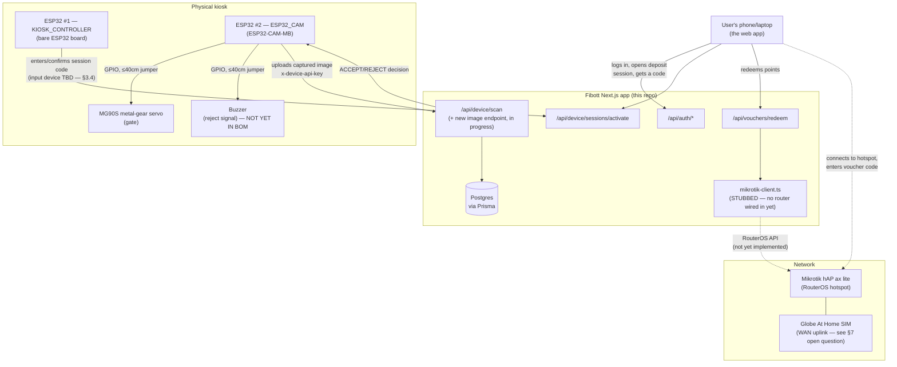

# Fibott — System, Hardware & Integration Design

> Piso-wifi, pero sa halip na barya, plastic bottle o can ang ihuhulog.
> Deposit a bottle or can → the machine checks it → points → points buy a
> WiFi voucher.

This is the single reference doc for how the physical kiosk, the ESP32
firmware, and the Next.js web app fit together. It reflects what is
**actually in this repo today** (routes, schema, seed data) plus the
**physical parts you actually have**, not an idealized version of either.
Update this file as decisions change — don't let it drift from the code.

---

## 1. Concept

- A kiosk has one intake hole sized for the two accepted item classes:
  standard PET soda bottles (e.g. Coke bottle) and standard aluminum soda
  cans. Nothing else is expected to physically fit.
- A servo-controlled gate sits **closed** across the hole by default.
- When an item is inserted, the ESP32-CAM captures it and the system
  decides: **PET bottle**, **aluminum can**, or **rejected** (not
  recognized as either).
- Accepted → gate opens, item drops through, points are awarded (5 for a
  bottle, 10 for a can — see [§5](#5-points--voucher-economy)).
- Rejected → gate stays closed, buzzer sounds so the user knows to take the
  item back out.
- Points accumulate in the user's account and are spent on vouchers (100
  points = 1 hour of WiFi) redeemed against a Mikrotik hotspot.

## 2. High-level architecture



Two independent loops, bridged only through the backend + database:

1. **Deposit loop** — kiosk hardware ↔ `/api/device/*` ↔ Postgres.
2. **WiFi-issuance loop** — user redeems points in the app ↔
   `mikrotik-client.ts` ↔ router. The kiosk hardware never talks to the
   router directly.

---

## 3. Physical hardware

### 3.1 Parts you have, and the role each plays

| Part | Qty | Role |
|---|---|---|
| Mikrotik hAP ax lite (L41G-2axD) | 1 | Hotspot AP — issues the WiFi vouchers users redeem points for |
| Globe At Home SIM | 1 | WAN uplink for internet — see [§7](#7-network--mikrotik) for a wiring question this raises |
| ESP32-CAM-MB (OV2640) | 1 | `ESP32_CAM` device — captures & uploads deposit images |
| Bare ESP32 dev board | 2 (1 spare) | `KIOSK_CONTROLLER` device — the primary one handles session-code activation; the second is a cold spare |
| MG90S servo (metal gear) | 1 | Drives the gate that blocks/opens the intake hole |
| Ethernet cables | — | Mikrotik ↔ LAN/backend |
| Jumper wires, M-F, ≤40cm | — | Short-range GPIO wiring inside the kiosk enclosure |

Two things worth flagging up front because they change what I wrote in an
earlier pass at the hardware doc:

- **ESP32-CAM-MB already has an onboard USB-to-serial chip (CH340C) and
  auto-reset circuit.** You flash it over a plain micro-USB cable — no
  separate FTDI adapter needed. (The bare AI-Thinker ESP32-CAM module
  *without* the MB base board would need one; yours doesn't.)
  See [`hardware/README.md`](../hardware/README.md) for the full pinout —
  that file has been corrected to match.
- **MG90S is a micro servo, not a heavy-duty one.** Typical datasheet
  figures: ~4.8–6V, ~650–700mA stall current, ~1.8–2.2 kg·cm torque. That's
  far lighter than the MG996R-class servo my first pass assumed — you do
  **not** need a 2A+ power supply for it. A simple dedicated 5V/1A supply
  (or even a USB power bank) is enough headroom; still keep it on its own
  rail rather than the ESP32's, since the ESP32's WiFi TX current spikes
  are enough on their own to brown out a shared regulator.

### 3.2 Deposit sequence (as you described it)

1. Gate is closed by default (servo holds the blocking position).
2. User inserts an item. It physically can't be bigger than a standard
   bottle/can — the hole itself is the size filter.
3. ESP32-CAM captures an image and sends it to the backend.
4. Backend classifies it as `PET_BOTTLE`, `ALUMINUM_CAN`, or `REJECTED`
   (this is the `classifier.ts` + `/api/device/*` work in progress — see
   [§6](#6-integration--api-contract)).
5. **Accepted:** gate opens, item falls through, points are credited to
   whichever user's deposit session is active.
6. **Rejected:** gate stays shut, buzzer sounds, user retrieves the item.

### 3.3 Board-role split: why two ESP32s

The schema already models two distinct device types
(`prisma/schema.prisma` → `enum DeviceType { ESP32_CAM KIOSK_CONTROLLER }`,
seeded in `prisma/seed.ts` as `Fibott-Kiosk-01-Cam` +
`Fibott-Kiosk-01-Controller`) — this matches your two-board setup exactly:

- **ESP32-CAM-MB → `ESP32_CAM`.** Captures the image, uploads it, receives
  the accept/reject decision back in the same HTTP response, and — because
  the decision arrives *at this board* — this is also the board that should
  directly drive the gate servo and the reject buzzer over GPIO. That's why
  the servo/buzzer wiring is drawn off the camera board in the diagram
  above, not the controller board.
- **Bare ESP32 → `KIOSK_CONTROLLER`.** Its existing job per
  [`/api/device/sessions/activate`](../src/app/api/device/sessions/activate/route.ts)
  is: take a 6-character deposit-session code and activate it, so the
  session is armed for the next accepted deposit. What physically *enters*
  that code at the kiosk is still open — see the gap below.

### 3.4 Open hardware gaps (flag before you wire anything)

These aren't in your current parts list or in the code yet — decide these
before committing to an enclosure/wiring layout:

1. **Buzzer.** Needed for the reject signal. A basic 5V active buzzer
   module is a single GPIO + power, cheap, and easiest to drive directly
   from the ESP32-CAM board.
2. **Item-presence trigger.** Nothing currently tells the ESP32-CAM
   *when* to snap a photo. Two options:
   - **IR break-beam sensor** at the chute entrance (recommended) — a
     couple dollars, one digital GPIO, dead simple and reliable: beam
     breaks → capture.
   - **Camera-only motion/frame-diff detection** — no extra part, but
     meaningfully more firmware complexity on a board that's already
     doing camera + WiFi, and less reliable.
3. **Session-code input at the kiosk.** `KIOSK_CONTROLLER`'s API expects a
   6-character code — something has to type or scan it in. Not in the
   parts list yet. Options in rough order of simplicity: a small keypad
   (4x4 matrix), an RFID/NFC tap using the code as a token, or a QR code
   scanner reading a code shown in the user's app. Worth deciding early
   since it drives what you order next.
4. **Mechanical chute sizing** — "kasya sa butas" is an enclosure/CAD
   decision (intake hole dimensioned for a standard soda bottle/can), not
   a firmware one. Flagging so it doesn't get lost.

Full pin-level wiring (GPIO map, servo/buzzer wiring diagram, provisioning
steps for a new device's API key) lives in
[`hardware/README.md`](../hardware/README.md) — this section is the
what/why, that file is the how.

---

## 4. Software: feature list vs. what's actually built

The repo already has essentially the full web app scaffolded. Status below
is from reading the actual route/page code, not assumptions.

### 4.1 User side

| Feature (your spec) | Status | Where |
|---|---|---|
| Login / Register / Forgot password / Email verification | ✅ Built | `src/app/(auth)/`, `src/app/api/auth/*` |
| Google Sign-In | ✅ Built | NextAuth Google provider, `src/lib/auth.ts` |
| Dashboard (points, items submitted, vouchers, recent activity) | ✅ Built | `src/app/(user)/dashboard/page.tsx` |
| Scan & Deposit history | ✅ Built | `src/app/(user)/dashboard/history/page.tsx` |
| Points Wallet (balance, earned/spent, transactions) | ✅ Built | `src/app/(user)/dashboard/wallet/` |
| Profile / change password | ✅ Built | `src/app/(user)/dashboard/profile/page.tsx` |
| Leaderboard | 🚧 Placeholder ("coming soon") | `src/app/(user)/dashboard/leaderboard/page.tsx` |

### 4.2 Admin side

| Feature (your spec) | Status | Where |
|---|---|---|
| Dashboard (users, items, vouchers, trends) | ✅ Built | `src/app/(admin)/admin/page.tsx` |
| User management (view/search) | 🚧 Partial — search/view work, suspend/edit not yet | `src/app/(admin)/admin/users/page.tsx` |
| Deposit history | ✅ Built | `src/app/(admin)/admin/deposits/page.tsx` |
| Voucher management | ✅ List view built (`voucher.findMany`); you flagged this as still being designed — see suggestion below | `src/app/(admin)/admin/vouchers/page.tsx` |
| Rewards management (points per material, voucher conversions) | ✅ Built | `src/app/(admin)/admin/rewards/` |
| Notifications | 🚧 Placeholder | `src/app/(admin)/admin/notifications/page.tsx` |
| Reports | 🚧 Placeholder | `src/app/(admin)/admin/reports/page.tsx` |
| Audit logs | ✅ Built | `src/app/(admin)/admin/audit-logs/page.tsx` |
| Leaderboard | 🚧 Placeholder | `src/app/(admin)/admin/leaderboard/page.tsx` |
| Profile | ✅ Built | `src/app/(admin)/admin/profile/page.tsx` |

**Voucher Management, since you're still deciding scope:** the data model
and redemption flow already exist end-to-end (`Voucher` status lifecycle:
`PENDING → ISSUED/FAILED → REDEEMED/EXPIRED`, via
[`/api/vouchers/redeem`](../src/app/api/vouchers/redeem/route.ts)). What's
missing is purely admin-side *visibility and override*: filter by status,
see which redemptions failed at the Mikrotik step and why
(`failureReason`), and a manual "mark expired / void" action. That's a
reasonable scope once you're ready — no schema changes needed.

### 4.3 Built this session / still open

- ✅ Server-side image classifier — [`src/lib/classifier.ts`](../src/lib/classifier.ts).
  Pretrained MobileNetV2 + a zero-shot ImageNet label mapping by default,
  with a fine-tuning path (`npm run ml:train`) to replace it with a real
  two-class head trained on your own kiosk photos. Full writeup:
  [`docs/ml.md`](ml.md) — including why the zero-shot mode is a weak can
  detector until you fine-tune it.
- ✅ Shared accept/reject/points logic extracted to
  [`src/lib/deposit.ts`](../src/lib/deposit.ts) (`processDeposit()`), used
  by both `/api/device/scan` (pre-classified, mainly for testing) and the
  new `/api/device/deposit-image` (real ESP32-CAM path: upload an image,
  get back `{ decision, servoAction, classification, ... }`).
- ⏳ Not yet built: `/api/device/deposit-image` doesn't persist the
  uploaded image anywhere (`imageUrl` stays unset) — worth adding once
  you've picked a storage target, both for the `Deposit.imageUrl` audit
  trail and because rejected/misclassified frames are exactly the training
  data `docs/ml.md`'s fine-tuning loop wants.
- `mikrotik-client.ts` is intentionally stubbed (`TODO(phase 2)` in the
  file) — real RouterOS API calls come once the router is reachable from
  the backend.

---

## 5. Points & voucher economy

Already seeded in `prisma/seed.ts`, matching your numbers exactly:

| Material | Points |
|---|---|
| PET bottle | 5 |
| Aluminum can | 10 |
| Rejected | 0 (rule exists but inactive) |

| Voucher | Cost | Grants |
|---|---|---|
| "1 Hour WiFi" | 100 points | 60 minutes of hotspot access |

Changing these doesn't require code changes — they're editable from
**Admin → Rewards** (`src/app/(admin)/admin/rewards/`).

---

## 6. Integration & API contract

Deposit flow, end to end:

1. User opens a deposit session in the app → `DepositSession` row created
   (`PENDING`), a 6-character `code` generated.
2. User walks to the kiosk, the code gets entered somehow (see
   [§3.4](#34-open-hardware-gaps-flag-before-you-wire-anything)) →
   `KIOSK_CONTROLLER` calls
   [`POST /api/device/sessions/activate`](../src/app/api/device/sessions/activate/route.ts)
   `{ code }` → session becomes `ACTIVE`, expires in 2 minutes.
3. Item inserted → ESP32-CAM captures a frame, uploads it to
   [`POST /api/device/deposit-image`](../src/app/api/device/deposit-image/route.ts)
   (multipart `image` file + optional `sessionCode`) → backend runs
   `classifier.ts` → gets `{ materialType, label, confidence }`.
4. Backend runs the shared accept/reject logic in
   [`src/lib/deposit.ts`](../src/lib/deposit.ts)'s `processDeposit()`
   (also used by [`/api/device/scan`](../src/app/api/device/scan/route.ts),
   the pre-classified path used for testing): checks for an active
   session, looks up the `RewardRule`, creates the `Deposit` row, awards
   points via `awardPoints()` if accepted.
5. Response back to the ESP32-CAM includes a `servoAction: "ACCEPT" |
   "REJECT"` the firmware uses to drive the gate/buzzer.
6. Later, user spends points →
   [`POST /api/vouchers/redeem`](../src/app/api/vouchers/redeem/route.ts)
   → `Voucher` created `PENDING` → points spent → `mikrotik-client.ts`
   called to create a hotspot user (currently a mock — returns a fake code
   immediately) → `Voucher` marked `ISSUED` with the real/mock code, or
   `FAILED` with points refunded.

Device auth for both `ESP32_CAM` and `KIOSK_CONTROLLER` calls is the
`x-device-api-key` header, checked in
[`src/lib/device-auth.ts`](../src/lib/device-auth.ts) against a bcrypt hash
— plaintext key is only ever shown once, at provisioning time (see
`hardware/README.md` §"Provisioning a new ESP32-CAM device").

---

## 7. Network & Mikrotik

- The hAP ax lite runs the hotspot the end user connects to and enters
  their voucher code on.
- The backend needs a network path to the router's RouterOS API (not the
  hotspot WiFi itself) to create/manage hotspot users — that's what
  `mikrotik-client.ts` will call once implemented.
- **Open question, not yet resolved:** hAP ax lite (L41G-2axD) is a WiFi
  access point/router — worth double-checking whether it has a SIM slot
  itself or whether the Globe At Home SIM is meant to go into a separate
  LTE modem/router that then feeds the hAP ax lite's WAN port over
  Ethernet. If it's the latter, that's another network hop to account for
  in the diagram in §2. Confirm against the actual unit before wiring the
  WAN side.
- Config is read from env vars already referenced in
  `src/lib/mikrotik-client.ts` (unset today — expected, since the router
  isn't wired in yet):
  ```
  MIKROTIK_HOST=
  MIKROTIK_USER=
  MIKROTIK_PASSWORD=
  MIKROTIK_HOTSPOT_PROFILE=default
  ```

---

## 8. Open decisions checklist

- [ ] Buzzer part — pick one, add to BOM.
- [ ] Item-presence trigger — IR break-beam (recommended) vs camera-only
      motion detection.
- [ ] Session-code input device at the kiosk (keypad / RFID / QR).
- [ ] Confirm hAP ax lite's WAN path for the Globe At Home SIM (§7).
- [ ] Admin Voucher Management page scope (suggested in §4.2, not yet
      built).
- [ ] Intake chute mechanical dimensions (enclosure/CAD, not software).

---

*Related docs: [`hardware/README.md`](../hardware/README.md) (pin-level
wiring, BOM, device provisioning) · [`docs/ml.md`](ml.md) (classifier
design and fine-tuning path).*
