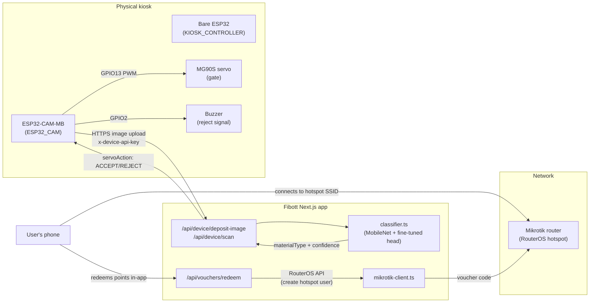

# Fibott Hardware Map

Fibott is a reverse-vending kiosk: a user deposits a PET bottle or aluminum
can, the machine classifies it, sorts it, and the backend awards points that
can be redeemed for a Mikrotik-issued WiFi voucher (`VoucherRule` →
`Voucher.mikrotikProfile/mikrotikVoucherRef` in `prisma/schema.prisma`).

> See [`docs/SYSTEM.md`](../docs/SYSTEM.md) for the full system/software/
> integration picture, including board-role rationale and open hardware
> decisions (buzzer, presence sensor, code-entry input). This file is the
> pin-level how-to: BOM, wiring, provisioning.

Physical components on hand:

| Component | Role | Talks to |
|---|---|---|
| **ESP32-CAM-MB** (AI-Thinker module + USB base board, OV2640) | Captures the deposited item, uploads the image to the backend, drives the sort gate + buzzer | Backend API over WiFi (`/api/device/*`), servo + buzzer (GPIO) |
| **Bare ESP32 dev board** (x2, one spare) | `KIOSK_CONTROLLER` — activates deposit sessions | Backend API over WiFi (`/api/device/sessions/activate`) |
| **MG90S servo** (metal gear, micro) | Physically opens/closes the intake gate | ESP32-CAM GPIO (signal) + its own 5V supply (power) |
| **Mikrotik hAP ax lite** (RouterOS, hotspot mode) | Issues the WiFi voucher a user redeems points for | Backend server only (RouterOS API), *not* the ESP32-CAM |

This maps 1:1 onto the existing schema: `Device.type` is `ESP32_CAM` or
`KIOSK_CONTROLLER` (both are already seeded in `prisma/seed.ts`); the
Mikrotik box isn't a `Device` row at all — it's a network appliance the
backend calls via `src/lib/mikrotik-client.ts`.

## System diagram



The ESP32-CAM and the Mikrotik router never talk to each other directly —
they're bridged only through the backend, via the `User`/`Deposit`/`Voucher`
rows in Postgres. That keeps the servo/camera loop and the WiFi-issuance loop
independently testable (you can stub `mikrotik-client.ts`, as it already is,
without touching the camera firmware at all).

## ESP32-CAM-MB pinout

The MB base board adds a CH340C USB-to-serial chip and auto-program circuit
to the AI-Thinker ESP32-CAM module — **flash it over a plain micro-USB
cable, no separate FTDI/USB-TTL adapter needed.** The underlying camera
module's GPIO map is unchanged, and it still has almost no free GPIOs —
most are wired directly to the OV2640 and can't be repurposed. This matters
because it's easy to pick a pin that silently breaks the camera or the boot
sequence.

| Function | GPIO | Notes |
|---|---|---|
| Camera data/clock/sync (D0–D7, XCLK, PCLK, VSYNC, HREF, SIOD, SIOC, PWDN) | 5, 18, 19, 21, 36, 39, 34, 35, 0, 22, 25, 23, 26, 27, 32 | **Reserved.** Do not reuse for anything else. |
| Onboard flash LED (bright white, next to lens) | 4 | Shared with SD card D1 — leave SD card unused (see below) |
| Onboard red status LED | 33 | Free to use as a "processing" indicator |
| **Servo signal (recommended)** | **13** | Not a strapping pin, not used by camera or SD — safe to drive at any time including boot |
| **Buzzer signal (recommended)** | **2** | Free once SD is unused; avoid driving it high during boot-mode entry (only matters while physically re-flashing) |
| Presence sensor input, if you add an IR break-beam (see `docs/SYSTEM.md` §3.4) | 14 or 15 | Either free GPIO works as a digital input |
| Fallback signal pin | 12 | Avoid unless the others are taken — MTDI strapping pin; an external pull-up during boot can force the wrong flash voltage and prevent boot |
| UART programming (via onboard CH340C, MB board's micro-USB) | 1 (TX), 3 (RX) | Only during flashing; not usable at runtime |

**SD card slot: leave unpopulated.** This design uploads images over WiFi
instead of logging to SD, which frees GPIO2/4/12/13/14/15 for the servo,
buzzer, and an optional presence sensor, and avoids the GPIO0/boot-mode
conflicts SD card use introduces.

## Wiring: ESP32-CAM-MB → MG90S servo

The MG90S is a micro servo (metal gears, plastic case) — typical datasheet
figures are ~4.8–6V and ~650–700mA stall current, well under what an
MG996R-class servo would draw. You do **not** need a heavy-duty supply for
it, but still keep it on its own rail rather than the ESP32's: the ESP32's
own WiFi TX current spikes are enough by themselves to brown out a shared
regulator and reset the camera mid-capture.

```
                +------------------+
                |   5V, ~1A PSU    |
                +----+--------+----+
                     |        |
                    (+)      (GND)
                     |        |
              +------+--+   +-+----------------+
              | Servo    |   |                  |
              | red wire |   |                  |
              +----------+   |                  |
                     |       |                  |
              +------+--+    |                  |
              | Servo    |   |                  |
              |brown/GND |---+------------------+---- ESP32-CAM-MB GND
              +----------+                       |
                     |                    +------+------+
              +------+--+                 | ESP32-CAM-MB|
              | Servo    |---(220Ω)-------| GPIO13      |
              |orange/sig|                 +-------------+
              +----------+
```

- **Common ground is mandatory** — ESP32-CAM-MB GND, servo PSU GND, and
  servo GND must all be tied together, or the PWM signal has no valid
  reference and the servo jitters or ignores commands.
- The 220–470Ω series resistor on the signal line protects GPIO13 from servo
  back-EMF; it's cheap insurance, not strictly required at this current
  level.
- Give the ESP32-CAM-MB itself its own clean 5V/500mA+ source (a shared,
  undersized supply is the #1 cause of random camera-init failures on this
  board).
- All jumper runs here are within your 40cm M-F jumper wire limit — servo,
  buzzer, and (if added) presence sensor all sit physically close to the
  camera board at the intake chute.

## Mikrotik router

The Mikrotik box runs standard RouterOS hotspot mode and is **not** wired to
the ESP32-CAM at all. It only needs:

- A LAN/WAN path to wherever the Fibott backend runs, so the backend can
  reach the RouterOS API (`api-ssl`, TCP 8729, or the RouterOS 7 REST API)
  to create one-time hotspot users — this is what `createHotspotVoucher()`
  in [`src/lib/mikrotik-client.ts`](../src/lib/mikrotik-client.ts) will call
  once it's implemented (currently stubbed, per the `TODO(phase 2)` comment
  — no router is connected yet).
- Its WAN uplink — confirm whether the hAP ax lite (L41G-2axD) takes the
  Globe At Home SIM directly or needs a separate LTE modem/router bridging
  in over its WAN Ethernet port. Unresolved; see `docs/SYSTEM.md` §7.
- Its own hotspot SSID/captive portal for end users to connect to and enter
  their voucher code.

Config lives in env vars already read by `getMikrotikClient()`:

```
MIKROTIK_HOST=            # router IP/hostname reachable from the backend
MIKROTIK_USER=            # RouterOS API user (least-privilege: hotspot user add/remove only)
MIKROTIK_PASSWORD=
MIKROTIK_HOTSPOT_PROFILE=default   # hotspot user profile name in RouterOS
```

None of these are set in `.env` yet — that's expected until the router is
physically racked and reachable.

## Provisioning a new ESP32-CAM device

Each physical unit needs a row in the `Device` table and an API key baked
into its firmware (sent as the `x-device-api-key` header, validated by
[`src/lib/device-auth.ts`](../src/lib/device-auth.ts)):

1. Insert a `Device` row with `type: ESP32_CAM` and a `location`.
2. Generate a key with `generateDeviceApiKey()` (in `device-auth.ts`) —
   store only the returned `hash`/`prefix` in the DB row; the `plaintext` is
   shown once and flashed into the firmware's config, never persisted
   server-side.
3. Firmware uses that key on every request to `/api/device/deposit-image`.

## Bill of materials

| Part | Have it? | Qty | Notes |
|---|---|---|---|
| ESP32-CAM-MB (AI-Thinker + USB base, OV2640) | ✅ | 1 per kiosk | Onboard USB, no FTDI needed |
| Bare ESP32 dev board | ✅ | 2 per kiosk (1 spare) | `KIOSK_CONTROLLER` role |
| MG90S servo (metal gear, micro) | ✅ | 1 per kiosk | Gate actuator |
| Mikrotik hAP ax lite | ✅ | 1 (shared, not per-kiosk) | Only needs backend network reachability, not proximity to kiosks |
| Globe At Home SIM | ✅ | 1 | WAN uplink — confirm slot location, see §"Mikrotik router" above |
| Ethernet cables | ✅ | — | Mikrotik ↔ LAN/backend |
| Jumper wires, M-F, ≤40cm | ✅ | — | Servo/buzzer/sensor to ESP32-CAM-MB |
| 5V/~1A power supply | ❌ | 1 per kiosk | Dedicated to servo, separate from camera's rail |
| 5V/500mA+ power supply | ❌ | 1 per kiosk | Dedicated to ESP32-CAM-MB |
| 220–470Ω resistor | ❌ | 1 per servo | Signal-line protection |
| Buzzer (5V active buzzer module) | ❌ | 1 per kiosk | Reject signal — not yet in your parts list |
| IR break-beam sensor (recommended) | ❌ | 1 per kiosk | Item-presence trigger — see `docs/SYSTEM.md` §3.4 for the alternative (camera-only detection) |
